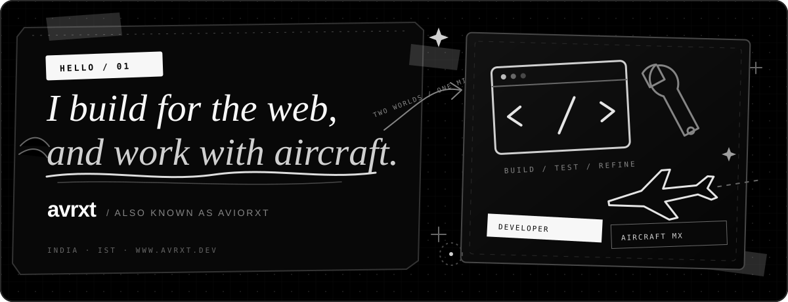

<p align="center">
  <a href="https://www.avrxt.dev">
    
  </a>
</p>

<p align="center">
  <a href="https://www.avrxt.dev"><strong>Website</strong></a>
  &nbsp;·&nbsp;
  <a href="https://www.avrxt.dev/about"><strong>About</strong></a>
  &nbsp;·&nbsp;
  <a href="https://www.avrxt.dev/tools"><strong>Tools</strong></a>
  &nbsp;·&nbsp;
  <a href="https://www.avrxt.dev/docs"><strong>Docs</strong></a>
  &nbsp;·&nbsp;
  <a href="https://www.instagram.com/aviorxt/"><strong>Instagram</strong></a>
</p>

<br />

## Building with precision.

I’m **avrxt** — also known as **aviorxt** — an independent developer and aircraft maintenance engineer based in India. I design quiet, purposeful digital products with the same mindset aviation demands: clarity, reliability, and attention to detail.

My work moves between full-stack engineering, interface design, practical browser tools, APIs, automation, and small experiments that deserve to exist.

```text
CURRENT SIGNAL
├─ building       avrxt.dev
├─ exploring      useful web systems + expressive interfaces
├─ engineering    TypeScript / React / Next.js
└─ principle      make it clear, make it useful, make it last
```

## Selected work

<table>
  <tr>
    <td width="50%" valign="top">
      <h3><a href="https://www.avrxt.dev">avrxt.dev ↗</a></h3>
      <p>My personal digital space: experiments, documentation, music signals, legal transparency, and carefully designed public utilities.</p>
      <p><code>Next.js</code> <code>TypeScript</code> <code>Supabase</code> <code>Vercel</code></p>
    </td>
    <td width="50%" valign="top">
      <h3><a href="https://www.avrxt.dev/tools">Public tools ↗</a></h3>
      <p>A privacy-conscious collection for network checks, DNS and RDAP inspection, typography, email diagnostics, quotes, and keyboard testing.</p>
      <p><code>Web APIs</code> <code>Security</code> <code>UI/UX</code> <code>Accessibility</code></p>
    </td>
  </tr>
  <tr>
    <td width="50%" valign="top">
      <h3><a href="https://www.avrxt.dev/muzix/chart">Muzix chart ↗</a></h3>
      <p>A Spotify-powered listening capsule for now-playing status, repeat signals, top artists, tracks, and monthly music patterns.</p>
      <p><code>Spotify API</code> <code>Data UI</code> <code>OAuth</code></p>
    </td>
    <td width="50%" valign="top">
      <h3><a href="https://www.avrxt.dev/signature">Digital signature ↗</a></h3>
      <p>A code-native identity experiment drawn with animated vector strokes, responsive motion, and a monochrome visual system.</p>
      <p><code>SVG</code> <code>Motion</code> <code>Creative coding</code></p>
    </td>
  </tr>
</table>

## Working toolkit

| Layer | Technologies |
|:--|:--|
| **Interface** | `TypeScript` · `React` · `Next.js` · `Tailwind CSS` · `HTML` · `CSS` |
| **Systems** | `Node.js` · `REST APIs` · `Supabase` · `PostgreSQL` · `OAuth` |
| **Delivery** | `Git` · `GitHub Actions` · `Vercel` · `Cloudflare` |
| **Craft** | `Responsive design` · `Accessibility` · `SEO` · `Web security` · `Performance` |

## How I work

- **Useful over noisy.** Every feature should earn its place.
- **Details are engineering.** Accessibility, responsiveness, security, and polish are part of the product.
- **Independent by design.** avrxt.dev is personal work, built and maintained by one individual.

<br />

<p align="center">
  <a href="https://www.avrxt.dev/contact"><strong>Start a conversation</strong></a>
  &nbsp;·&nbsp;
  <a href="https://github.com/aviorxt?tab=repositories"><strong>Explore repositories</strong></a>
</p>

<p align="center">
  <sub>Designed and maintained with 🩶 by <a href="https://www.instagram.com/aviorxt/">@aviorxt</a></sub>
</p>
